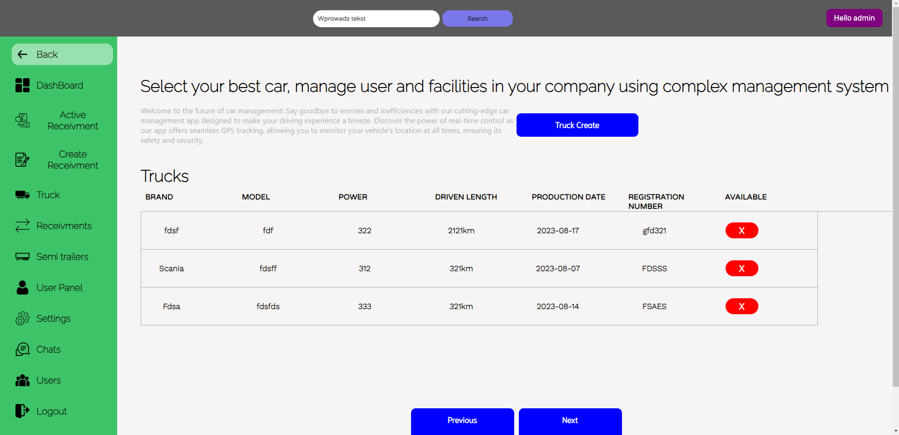
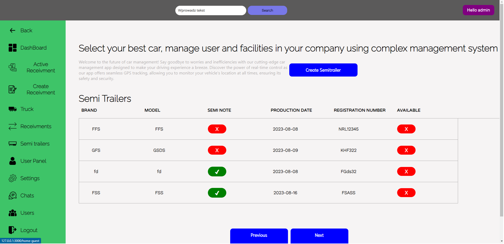
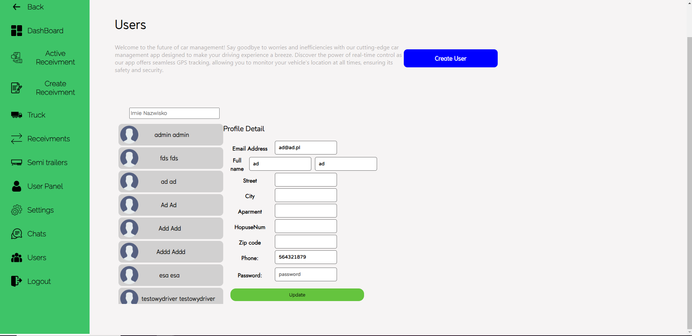
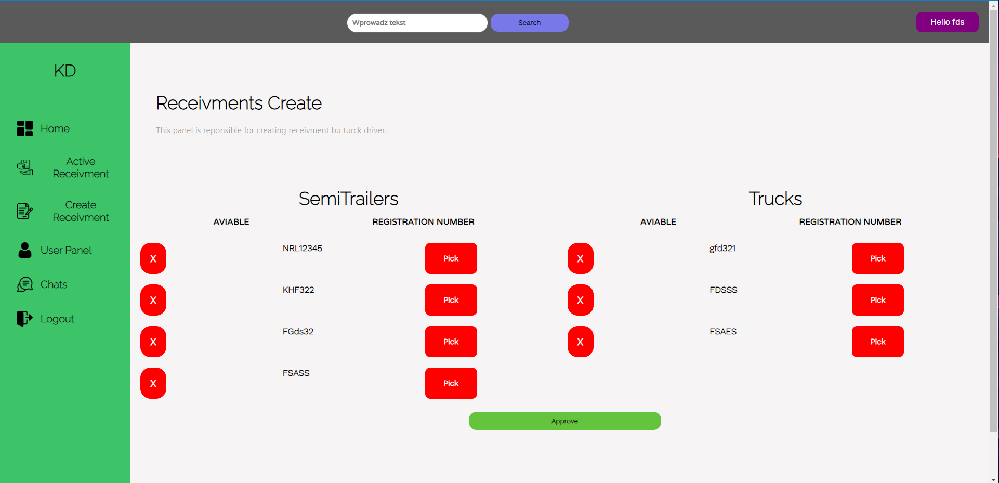
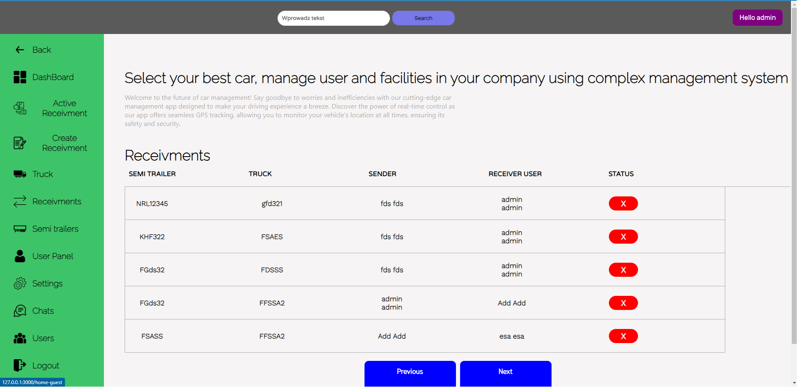
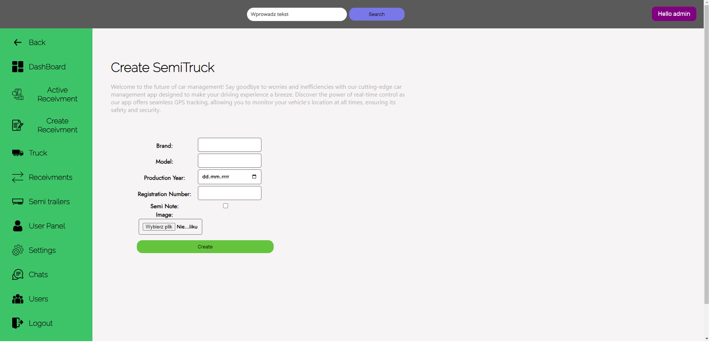
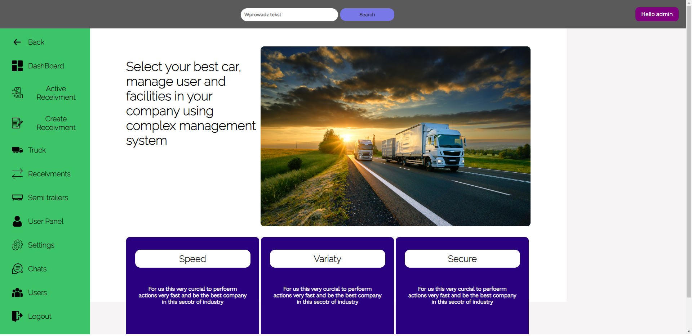
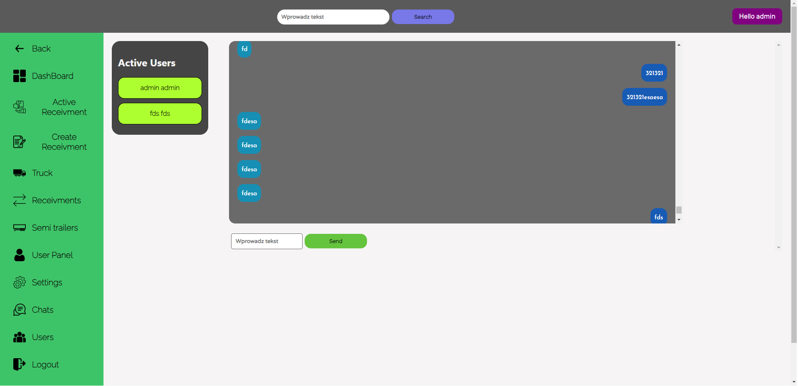
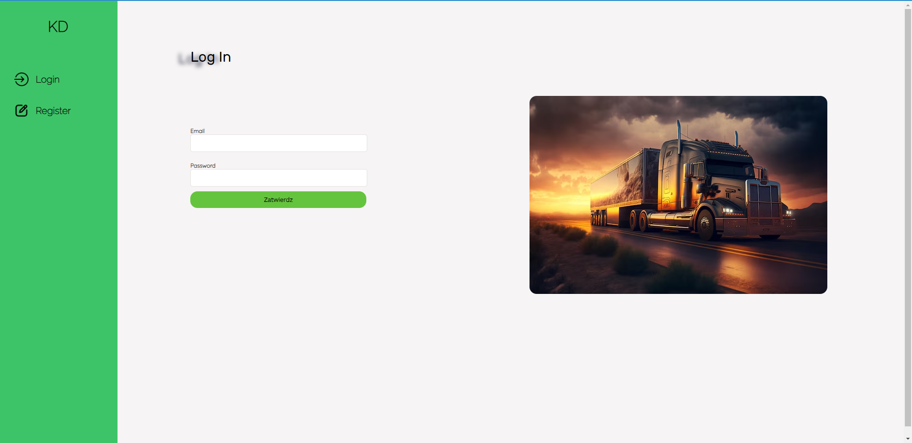

# LogistykaRepo

The project's topic is managing a delivery company. It offers options to create new users, trucks, and update locations. This project is inspired by an idea I developed from my university lessons. We were tasked with creating an application to manage processes such as assigning trucks and semitrailers to drivers and checking the current status of deliveries. In the project, I utilized Django and the Django REST framework. Additionally, I integrated Google API to monitor and track the positions of our drivers. The entire frontend was developed using React.js

Entire frontend was created using React.js  

# Used technologies
+ Django
+ Django REST Framework
+ Channels
+ React.js
+ Axios
+ CSS
+ HTML

# Chat
The chat system that was created is entirely based on Django Channels. Additionally, for this purpose, I switched my development server to Daphne.

We can initiate conversations with brand new users. Upon logging in and visiting a specific URL, we are presented with a list of all users and conversations

# How start this
1. Create virtual environment
    ### `python -m venv your environment_name`
2. Inside virtual environment clone repository 
    ### `git clone https://github.com/Kamil3162/LogistykaRepo.git `
3. Active virtual environment and install all required modules
    - inside virtual environment directory go to Script and run activate.bat 
    ### `Scripts\activate.bat`
    ### `pip install -r requirements.txt `
4. Add to your environment google api key to have an access os.getenv('GOOGLE_API')
5. Make a migrations of all models data inside project files where we have manage.py 
    ### `python manage.py makemigrations`
    ### `python manage.py migrate`
6. Inside cloned repository make a checkout on master branch   
   ### `git checkout master`
7. Run entire cloned project, you have to go inside project directory with all files   
   ### `daphne Logistyka.asgi:application -p 8000`
8. You can have a different port but React is prepared on this particular communication port

# Session
Session and authentication process is based on JWT token.

# /trucks

# /truck
[truck.png](truck.png)
# /semitrailers

# /semitrailer

# /users

# /user

# /receivment-create/

# /active-receivment/

# /receivments

# /semitrailer-create

# /home

# /chat

# /login

