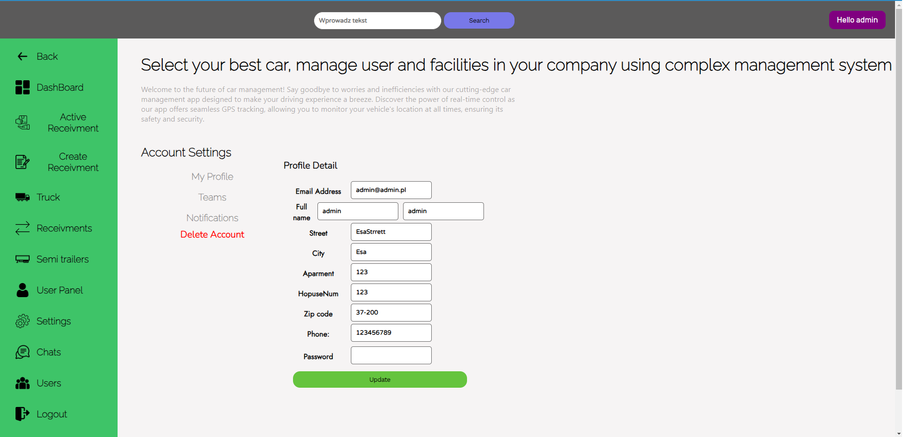

# LogistykaRepo

Topic of project is  to manage delivery company.
You have options to create new users, trucks , update locations.
Project is based on idea which I get from my lessons on the university.
We had a task to create application to manage a processes according to assign truck and semitrailers for driver and check actual status of delivery.
In the project i used a Django, Django REST framework also i added Google API to control and check position of our driver .

Entire frontend was created using React.js  

# Used technologies
+ Django
+ Django REST Framework
+ Channels
+ React.js
+ Axios
+ CSS
+ HTML

# Chat
Chat those was created is all based on Chanells from Django. Also using this i change my development server on daphne
- We can start conversation with brand new users
- During login and go on url we have list of all users/conversations

# How start this
1. Create virtual environment
    ### `python -m venv your environment_name`
2. Inside virtual environment clone repository 
    ### `git clone https://github.com/Kamil3162/LogistykaRepo.git `
3. Active virtual environment and install all required modules
    - inside virtual environment directory go to Script and run activate.bat 
    ### `Scripts\activate.bat`
    ### `pip install -r requirements.txt `
4. Add to your environment google api key to have an access os.getenv('GOOGLE_API')
5. Make a migrations of all models data inside project files where we have manage.py 
    ### `python manage.py makemigrations`
    ### `python manage.py migrate`
6. Inside cloned repository make a checkout on master branch   
   ### `git checkout master`
7. Run entire cloned project, you have to go inside project directory with all files   
   ### `daphne Logistyka.asgi:application -p 8000`
8. You can have a different port but React is prepared on this particular communication port

# Session
Session and authentication process is based on JWT token.

# /trucks

# /truck
[truck.png](truck.png)
# /semitrailers

# /semitrailer

# /users

# /user

# /receivment-create/

# /active-receivment/

# /receivments

# /semitrailer-create

# /home

# /chat

# /login

